# svg-terminal

[](https://github.com/williamzujkowski/svg-terminal/actions/workflows/ci.yml)
[](https://github.com/williamzujkowski/svg-terminal/actions/workflows/codeql.yml)
[](https://www.npmjs.com/package/svg-terminal)
[](https://www.npmjs.com/package/svg-terminal)
[](https://nodejs.org/)
[](./LICENSE)

Generate animated SVG terminals from a declarative YAML config. The output is a single self-contained SVG that works inside GitHub's sandbox — no script, no external assets.


<sub>Demo above is the actual SVG this library produces. Source: [`examples/demo.yml`](./examples/demo.yml). Regenerate with `npm run demo`.</sub>

### Try in 60 seconds

```bash
npx svg-terminal init                       # writes terminal.yml
npx svg-terminal generate                   # writes terminal.svg
npx svg-terminal blocks                     # lists all 48 blocks
```

Or as a GitHub Action — refresh your profile README on a schedule:

```yaml
- uses: williamzujkowski/svg-terminal@v1
  with:
    config: terminal.yml
    output: terminal.svg
    commit: true
```

See the full [GitHub Action](#github-action) section below, the [block catalog](./examples/blocks/) (48 blocks, one preview each), and the [12-theme gallery](#themes).

### What's in the box

- **Declarative YAML config** — write blocks, pick a theme, run the CLI
- **48 built-in blocks** — across identity, retro / fake-system, status, ASCII art, single- and multi-line animation, and humor categories. Browse the [block catalog](./examples/blocks/) for previews of each
- **12 built-in themes** — dracula, nord, monokai, amber, green-phosphor, cyberpunk, solarized-dark, win95, catppuccin, tokyo-night, gruvbox, high-contrast (with chrome to match)
- **Frame animation** — `BlockResult.animation = { frames, fps, loop }` powers the 10 animated blocks (spinners, clock, dice, progress bar, etc.). Frames may be single- **or multi-line** as of #69 (`jumping-jack` is the reference multi-line block)
- **Dynamic-block cache** — the 5 cacheable blocks (weather, github-stats, github-languages, quote, fun-fact) write to `.svg-terminal-cache.json`. Pair with `--frozen-cache` for offline CI builds
- **Reduced-motion respected** — `@media (prefers-reduced-motion)` clamps the CSS fade-ins AND (since v0.17) the frame cycle. SMIL-driven typing reveal, cursor walk, and scroll-on-overflow remain animated; pair with `--static` for full stillness
- **Schema-validated, XSS-safe** — strict zod schema on every config field; user-controllable values are escaped at SVG emit sites. See [SECURITY.md](./SECURITY.md)
- **No runtime deps in the output** — SMIL + CSS animation, inline, GitHub-sandbox-safe
- **CLI + library** — `npx svg-terminal generate`, or `import { generate } from 'svg-terminal'`. Requires Node 22+

## Quick Start

```bash
npx svg-terminal init                       # Creates terminal.yml
npx svg-terminal generate                   # Generates terminal.svg
npx svg-terminal generate --watch           # Rebuild on every save
npx svg-terminal blocks <name>              # Inspect a block's config schema
```

## Configuration

Edit `terminal.yml`:

```yaml
theme: dracula

window:
  title: "dev@my-machine:~"

terminal:
  prompt: "dev@box:~$ "

blocks:
  - block: neofetch
    config:
      username: dev
      hostname: my-machine
      role: Full-Stack Developer
      languages: TypeScript, Rust, Go

  - block: fortune
    config:
      fortunes:
        - "The best code is no code at all."
        - "Talk is cheap. Show me the code."

  - block: custom
    config:
      command: echo "Hello!"
      lines:
        - "[[fg:green]]Welcome to my terminal![[/fg]]"
```

## Themes

| Theme | Description |
|-------|-------------|
| `dracula` | Dark purple/green theme (default) |
| `nord` | Arctic blue/frost palette |
| `monokai` | Classic warm dark theme |
| `amber` | Vintage amber CRT (pairs well with `effects.textGlow: true`) |
| `green-phosphor` | Classic green-on-black phosphor (pair with glow) |
| `cyberpunk` | Neon magenta/cyan on near-black |
| `solarized-dark` | Ethan Schoonover's solarized dark palette (lifted prompt/comment for WCAG AA) |
| `win95` | Authentic Windows 95 chrome — auto-switches `window.style: win95` |
| `catppuccin` | Catppuccin Mocha — soothing pastel dark theme |
| `tokyo-night` | Tokyo Night (storm variant) — popular for Vim/Neovim |
| `gruvbox` | Gruvbox Dark medium — retro warm contrast |
| `high-contrast` | WCAG AAA pure-black-on-white palette — accessibility / slides / projector |

Special value: `theme: random` rotates through all themes deterministically by day of year — gives you a different look every day without committing to one.

<details>
<summary>Theme gallery — click to expand all 12</summary>

Each is the same 2-block config (motd + neofetch) rendered against the named theme. Source in [`examples/gallery/_template.yml`](./examples/gallery/_template.yml).

| | |
|---|---|
| **dracula**<br> | **nord**<br> |
| **monokai**<br> | **amber**<br> |
| **green-phosphor**<br> | **cyberpunk**<br> |
| **solarized-dark**<br> | **win95**<br> |
| **catppuccin**<br> | **tokyo-night**<br> |
| **gruvbox**<br> | **high-contrast**<br> |

</details>

## Blocks

Run `svg-terminal blocks` to list all 48 (cacheable ones marked `*`), or `svg-terminal blocks <name>` to print one block's config schema directly without grepping the source.

| Block | Description |
|-------|-------------|
| `neofetch` | System-info display with configurable fields |
| `fortune` | Random quote/fortune in ASCII box |
| `custom` | Arbitrary text with `[[fg:color]]` markup |
| `motd` | Welcome banner / message of the day |
| `dad-joke` | Q&A joke in an ASCII box (daily rotation) |
| `htop` | Colorful process/resource monitor display |
| `profile` | Developer profile info card |
| `goodbye` | Farewell message with well-wishes |
| `npm-install` | Humorous npm dependency tree |
| `blog-post` | Blog post title in a box |
| `national-day` | Fun national day celebration |
| `systemctl` | Fake systemd service status |
| `weather` | Live weather from wttr.in (also embeds in MOTD) |
| `github-stats` | Live GitHub user stats (repos, followers) |
| `github-languages` | Top languages across a user's public repos, with percentage bars |
| `quote` | Random quote from dummyjson.com |
| `fun-fact` | Random fun fact from uselessfacts.jsph.pl |
| `vim-exit` | The eternal "how do I quit vim?" meme |
| `sudo-sandwich` | xkcd 149 callback |
| `rm-rf` | Dramatic fake `rm -rf /` with commentary |
| `fork-bomb` | Mock fork-bomb warning ("turn your laptop fan into a leaf blower") |
| `kernel-panic` | Friendly BSOD spoof in terminal text |
| `segfault` | Fake core dump with corrupted backtrace |
| `whoami` | Username + existential identity bullets |
| `last-login` | `last` output with awkward 3am login timestamps |
| `finger` | Faux finger(1) card with snarky plan lines |
| `who` | `who` listing with ghost users (debugger, coffee, sanity) |
| `uptime` | Ridiculous uptime ("up 632 days, that one incident") |
| `matrix-rain` | Single-frame Matrix rain screen with ACCESS GRANTED footer |
| `cowsay` | Speech bubble + ASCII cow (with word-wrap) |
| `loading-spinner` | Braille spinner cycling at configurable fps |
| `heartbeat` | Pulsing heart — emotional hook for a project you love |
| `spinning-gear` | Rotating `\|/-\\` gear for DevOps/infra vibes |
| `blinking-eyes` | Kaomoji mascot that blinks every few seconds |
| `countdown` | T-minus N..0..GO! launch stinger (plays once, freezes on GO) |
| `sparkline` | ASCII sparkline (`▁▂▄▇▆▅▃▂`) from a numeric series |
| `bbs-login` | Retro 1980s BBS welcome banner — pairs with `amber` / `green-phosphor` |
| `build-badge` | Terminal-style project status card (tests / lint / coverage) |
| `license-card` | Boxed License / Copyright card |
| `ascii-clock` | HH:MM:SS clock with pulsing colon separators (12h / 24h) |
| `progress-bar` | Fake build progress bar that fills 0% → 100% |
| `bouncing-dot` | Single glyph bouncing left ↔ right |
| `dice-roll` | N d6 dice that tumble and land on a result |
| `jumping-jack` | Multi-line stick figure doing jumping jacks (reference multi-line animation) |
| `palette-swatch` | One-line render of all 16 theme palette colors |
| `semver-bump` | Current semver + bump preview (major/minor/patch) |
| `ascii-calendar` | Current-month calendar grid with today highlighted |
| `toc` | Auto-generated markdown anchor-link table of contents |

### Dynamic API Blocks

Blocks marked with "Live" fetch data at build time from free, SFW APIs. They gracefully fall back to static content on failure.

```yaml
# Weather in MOTD banner
- block: motd
  config:
    title: "MY TERMINAL"
    weather:
      location: NYC       # City name or coordinates
      units: imperial     # imperial, metric, or both

# Standalone weather block
- block: weather
  config:
    location: "Los Angeles"
    units: metric
    compact: false

# GitHub profile stats
- block: github-stats
  config:
    username: your-github-username

# Top languages across a user's public repos
- block: github-languages
  config:
    username: your-github-username
    top: 5          # top N languages (1-10, default 5)
    barWidth: 20    # bar width in chars (5-40, default 20)

# Random fun fact
- block: fun-fact
```

Set `fetchTimeout` at the top level to control API timeout (default: 10000ms):

```yaml
fetchTimeout: 15000  # 15 seconds — generous for slow APIs
```

### Accessibility

Every generated SVG carries `role="img"`, an `aria-label` summary of the first commands, plus a `<title>` and `<desc>` as its first children. The `<desc>` contains the full final-frame content (every command prefixed with the prompt, every output line with color markup stripped) so screen-reader users can read more than the 5-command summary.

Opt out if your terminal output is sensitive and you don't want it duplicated as plain text inside the SVG payload:

```yaml
accessibility:
  describe: false   # default true — emit <desc> with full content
```

**Reduced-motion caveat.** The SVG emits an inline `@media (prefers-reduced-motion: reduce)` rule, which applies to CSS animations — the fade-ins and the frame cycle (single- and multi-line) honor it (migrated SMIL → CSS in v0.17). The remaining SMIL holdouts — typing reveal, cursor walk, and scroll-on-overflow — don't read the same CSS media query, so users who set the OS-level reduced-motion preference still see those animate. If that's a problem for your audience, generate with `--static` — same content, no motion at all.

### Caching API responses

Dynamic blocks cache their responses in `.svg-terminal-cache.json` next to your config file (24h TTL by default). Commit that file alongside the YAML and CI builds become deterministic — no upstream hits, no diff churn from quote-of-the-minute drift.

```yaml
# Top-level overrides
cacheTTL: 86400         # seconds (default 86400 = 24h)
cachePath: ".cache.json" # relative to the config file (must stay inside)
```

CLI control:

```bash
svg-terminal generate                       # use cache if fresh, fetch + write back when stale
svg-terminal generate --refresh-cache       # ignore cache entries, re-fetch everything
svg-terminal generate --frozen-cache        # serve only cached values, never fetch (CI offline)
svg-terminal generate --no-cache            # bypass cache entirely (don't read, don't write)
```

**Reproducibility note:** committed cache + a generous `cacheTTL` makes CI _reproducible_; pair with `--frozen-cache` to make it _truly offline_ (the build fails loudly if any block lacks a cached entry, rather than silently reaching for the network).

**Privacy note:** the cache file stores the raw API payloads. If a block fetches data you'd rather not commit (e.g. a private GitHub profile), either skip that block in versioned configs or add `.svg-terminal-cache.json` to `.gitignore`.

### Custom Blocks

Custom blocks declare a strict zod `configSchema` so typos throw `BlockConfigError` at config-load time instead of silently falling back to defaults. Skipping the schema is allowed but discouraged — see [CONTRIBUTING.md](./CONTRIBUTING.md#adding-a-new-block).

```typescript
import { z } from 'zod';
import { registerBlock, generate } from 'svg-terminal';

registerBlock({
  name: 'my-block',
  configSchema: z.object({
    greeting: z.string().optional(),
  }).strict(),
  render(context, config) {
    const greeting = (config.greeting as string) ?? 'hello';
    return {
      command: 'my-command',
      lines: [`[[fg:green]]${greeting}, world[[/fg]]`],
    };
  },
});
```

## Programmatic API

```typescript
// ESM. Run as `node --experimental-vm-modules` or save as .mjs / set "type":"module".
import { generate, generateStatic } from 'svg-terminal';

async function main() {
  const svg = await generate({
    theme: 'nord',
    blocks: [
      { block: 'neofetch', config: { username: 'dev' } },
      { block: 'custom', config: { command: 'date', lines: ['2026-05-25'] } },
    ]
  }, {
    // All fields optional. configPath anchors cachePath resolution if you
    // want the cache; cacheMode is one of 'normal' | 'refresh' | 'frozen' | 'off';
    // now lets you pin context.now for reproducible test/demo output.
    configPath: '/abs/path/to/config.yml',
    cacheMode: 'frozen',
    now: new Date('2026-05-25T13:37:00Z'),
  });
}
main();
```

`generateStatic` returns the same content as a non-animated SVG — useful for accessibility fallbacks and social-preview cards.

`inspectCache(userConfig, configPath)` returns `{filePath, results}` where each result reports per-cacheable-block status (`OK` / `STALE` / `MISS`) with age in seconds — useful for building your own "is the cache hot?" CI gates without invoking the `svg-terminal cache check` subcommand. `userConfig` is the parsed config object; `configPath` anchors cache-path resolution.

## GitHub Action

Complete `.github/workflows/refresh-svg.yml` for a weekly README refresh:

```yaml
name: Refresh SVG terminal
on:
  schedule:
    - cron: '0 12 * * MON'   # Mondays at 12:00 UTC
  workflow_dispatch:          # also run on demand

jobs:
  refresh:
    runs-on: ubuntu-latest
    permissions:
      contents: write         # required for commit: true
    steps:
      - uses: actions/checkout@v4
      - uses: williamzujkowski/svg-terminal@v1
        with:
          config: terminal.yml
          output: terminal.svg
          commit: true
```

For maximally reproducible CI, commit `.svg-terminal-cache.json` alongside `terminal.yml` and set `cache-mode: frozen` — every build will serve cached payloads with zero network calls. The build fails loudly if a cacheable block is missing an entry:

```yaml
- uses: williamzujkowski/svg-terminal@v1
  with:
    config: terminal.yml
    output: terminal.svg
    cache-mode: frozen   # normal | refresh | frozen | off
    static: false        # set true to skip animation
    minify: false        # set true to strip inter-element whitespace
    commit: true
    commit-message: chore(readme): refresh terminal svg
```

The action commits as `github-actions[bot]`; the `commit` input only runs `git add output + git commit + git push` against the current branch. Skip `commit: true` and add your own commit step if you need signed commits or a custom author.

## Text Markup

Blocks support inline color markup:

```
[[fg:green]]green text[[/fg]]
[[fg:cyan]][[bold]]bold cyan[[/bold]][[/fg]]
[[dim]]dimmed text[[/dim]]
```

Available colors: `red`, `green`, `yellow`, `blue`, `magenta`, `cyan`, `white`, `orange`, `purple`, `pink`, `comment`, plus `bright_*` variants.

## ASCII Boxes

The box generator supports multiple styles:

```typescript
import { createBox } from 'svg-terminal';

createBox({ style: 'rounded', width: 40, lines: ['Hello!'] });
// ╭──────────────────────────────────────╮
// │ Hello!                               │
// ╰──────────────────────────────────────╯
```

Styles: `double` (╔═╗), `rounded` (╭─╮), `single` (┌─┐), `heavy` (┏━┓), `dashed` (┌╌┐)

## Contributing

See [CONTRIBUTING.md](./CONTRIBUTING.md) for the local dev loop, the block/theme contribution recipes, and PR conventions.

## License

MIT
