# Block catalog

48 built-in blocks. One SVG per block; click a thumbnail to view full size.

Regenerate: `npm run demo` (auto-built from `listBlocks()` so a new block gets a catalog row for free).

| Block | Description | Preview |
|-------|-------------|---------|
| `custom` | Display custom text with optional [[fg:color]] markup |  |
| `neofetch` | Display system-info style output like neofetch |  |
| `fortune` | Display a random fortune or quote in an ASCII box |  |
| `motd` | Display a welcome banner / message of the day |  |
| `dad-joke` | Display a dad joke in a fancy ASCII box |  |
| `htop` | Display an htop-style process and resource monitor |  |
| `profile` | Display a developer profile info card |  |
| `goodbye` | Display a farewell message |  |
| `npm-install` | Display a humorous npm install dependency tree |  |
| `blog-post` | Display a blog post title in a box |  |
| `national-day` | Display a fun national day celebration |  |
| `systemctl` | Display a systemd-style service status |  |
| `weather` * | Display current weather conditions from wttr.in |  |
| `github-stats` * | Display live GitHub user statistics |  |
| `github-languages` * | Top languages in a user's public repos, with percentage bars |  |
| `quote` * | Display a random inspirational quote |  |
| `fun-fact` * | Display a random fun fact |  |
| `vim-exit` | The classic "how do I exit vim?" message |  |
| `sudo-sandwich` | xkcd 149 "make me a sandwich" callback |  |
| `rm-rf` | Fake `rm -rf /` with dramatic narration |  |
| `fork-bomb` | Mock fork-bomb warning with practical consequences |  |
| `kernel-panic` | A friendly kernel panic / BSOD spoof |  |
| `segfault` | Fake segmentation fault with a corrupted backtrace |  |
| `whoami` | Real `whoami -a` style (default) or existential bullets via `verbose: true` |  |
| `last-login` | `last` output with embarrassing timestamps and parentheticals |  |
| `finger` | Faux finger(1) user info card |  |
| `who` | `who` output with ghost users (debugger, coffee, sanity) |  |
| `uptime` | Fake uptime with absurd numbers and SRE commentary |  |
| `matrix-rain` | Single-frame Matrix rain screen with ACCESS GRANTED footer |  |
| `cowsay` | A cow says something. The cow is always right. |  |
| `loading-spinner` | A Braille spinner that cycles continuously |  |
| `heartbeat` | Pulsing heart for a project you love |  |
| `spinning-gear` | Rotating ASCII gear — the "machinery working" feel |  |
| `blinking-eyes` | Kaomoji eyes that blink — README mascot that feels alive |  |
| `countdown` | T-minus N..0..go! launch stinger |  |
| `sparkline` | ASCII sparkline (▁▂▄▇▆▅▃▂) for a metric trend |  |
| `bbs-login` | Retro 1980s BBS welcome banner — pairs with amber / green-phosphor |  |
| `build-badge` | Terminal-style project status card (tests / lint / coverage) |  |
| `license-card` | Boxed License / Copyright card — saves a README section |  |
| `ascii-clock` | HH:MM:SS clock with pulsing colon separators |  |
| `progress-bar` | Fake build/install progress bar that fills 0% → 100% |  |
| `bouncing-dot` | A single glyph bouncing left ↔ right |  |
| `dice-roll` | Roll N d6 dice with a tumble animation that lands on a result |  |
| `palette-swatch` | One-line render of the theme palette — useful for theme docs |  |
| `semver-bump` | Current semver + bump preview (major/minor/patch) |  |
| `ascii-calendar` | Current-month calendar grid with today highlighted |  |
| `toc` | Auto-generates a markdown anchor-link table of contents |  |
| `jumping-jack` | A multi-line stick figure doing jumping jacks |  |

`*` = cacheable block (participates in the on-disk dynamic-block cache).
